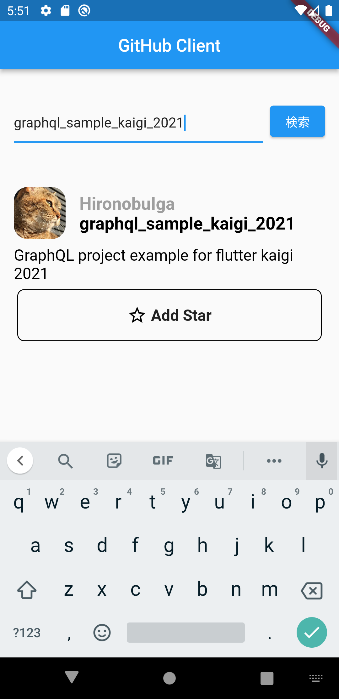

# graphql_example_flutter_kaigi_2021

Flutter sample project for FlutterKaigi 2021.
This project uses [github graphql api](https://docs.github.com/ja/graphql) for its endpoint and [ferry](https://github.com/gql-dart/ferry) for its client library.

# How to Start

To start this app, you need to make Personal Access Token.
If you don't have any, please make it.
You can refer to [document by GitHub](https://docs.github.com/ja/authentication/keeping-your-account-and-data-secure/creating-a-personal-access-token).

After you make it, please insert it into code below in [client.dart](./lib/network/client/client.dart).
Now you can run this app and interact with github via this project.

```dart
// initialize link
final httpLink = HttpLink("https://api.github.com/graphql");
final authLink = AuthLink(getToken: () => "Bearer token"); // insert your token here
```

# App Features


## Search Repositories
You can search repositories with words.
This project uses query for this feature.
You can check query statement in [list_screen.query.graphql](lib/screen/list_screen/graphql/list_screen.query.graphql).

## Add / Remove Star to Repository
You can add or remove star from searched repositories.
This project uses mutations for this feature.
you can check add star mutation in [add_star.mutation.graphql](lib/network/mutation/add_star/graphql/add_star.mutation.graphql) and remove star mutation in [remove_star.mutation.graphql](lib/network/mutation/remove_star/graphql/remove_star.mutation.graphql).